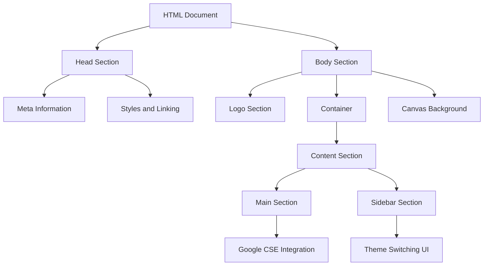
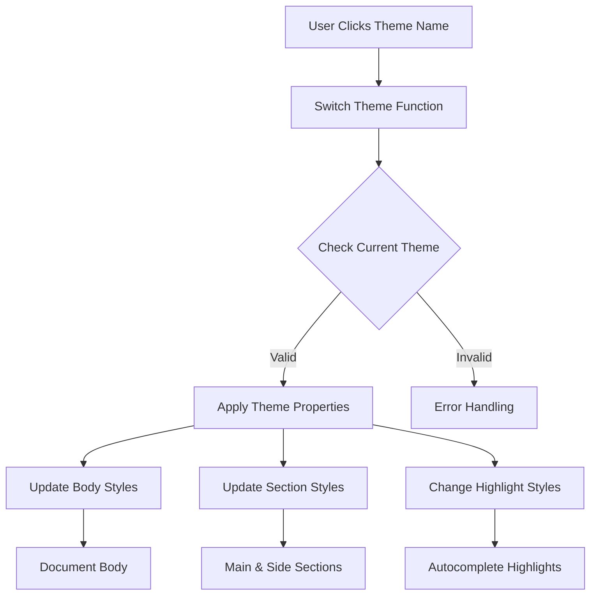
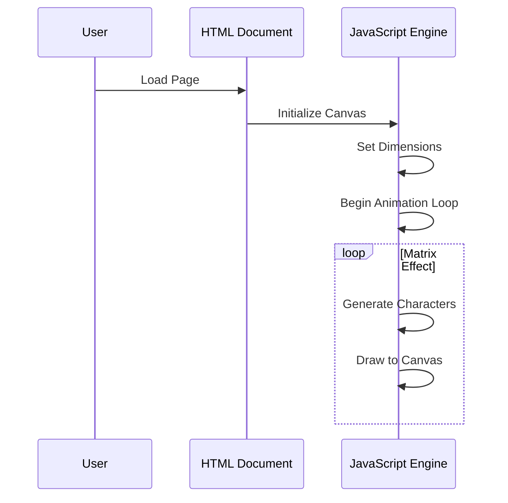

To provide a clear understanding of the code's complexities, functionalities, and potential expanding capabilities, I'll create a series of Mermaid diagrams to illustrate the overall structure and possible enhancements.

### **1. High-Level Structure Diagram**

This diagram outlines the key components of the HTML page, highlighting the layout and main features.

### **2. Theme Switching Functionality**

Illustrates how the theme switching mechanism is designed and how it updates the document with the selected theme.

### **3. Canvas and Matrix Effect**

The structure capturing how the matrix effect background is generated using JavaScript and Canvas API.

