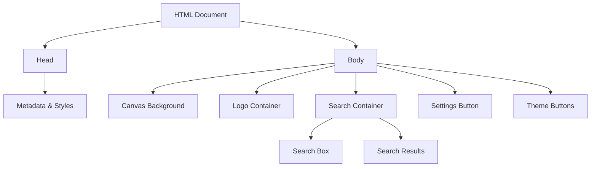
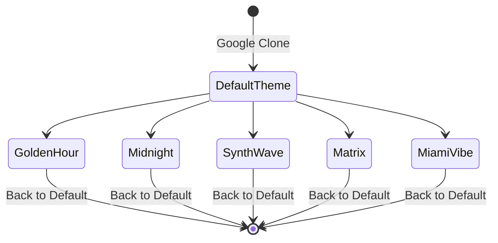
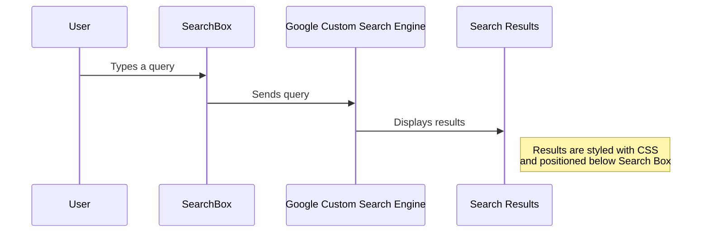

## Flowchart for HTML Structure

```mermaid
%% Flowchart for HTML Structure
flowchart TD
    A[HTML Document] --> B[Head]
    B --> C[Metadata & Styles]
    A --> D[Body]
    D --> E[Canvas Background]
    D --> F[Logo Container]
    D --> G[Search Container]
    G --> H[Search Box]
    G --> I[Search Results]
    D --> J[Settings Button]
    D --> K[Theme Buttons]

```

## State Diagram for Theme Management

```mermaid
%% State Diagram for Theme Management
stateDiagram-v2
    [*] --> DefaultTheme: Google Clone
    DefaultTheme --> GoldenHour
    DefaultTheme --> Midnight
    DefaultTheme --> SynthWave
    DefaultTheme --> Matrix
    DefaultTheme --> MiamiVibe

    GoldenHour --> [*]: Back to Default
    Midnight --> [*]: Back to Default
    SynthWave --> [*]: Back to Default
    Matrix --> [*]: Back to Default
    MiamiVibe --> [*]: Back to Default

```

## Sequence Diagram for Search Result Handling

```mermaid
%% Sequence Diagram for Search Result Handling
sequenceDiagram
    participant User
    participant SearchBox
    participant GoogleCSE as Google Custom Search Engine
    participant SearchResults as Search Results

    User->>SearchBox: Types a query
    SearchBox->>GoogleCSE: Sends query
    GoogleCSE->>SearchResults: Displays results

    note right of SearchResults: Results are styled with CSS <br> and positioned below Search Box

```