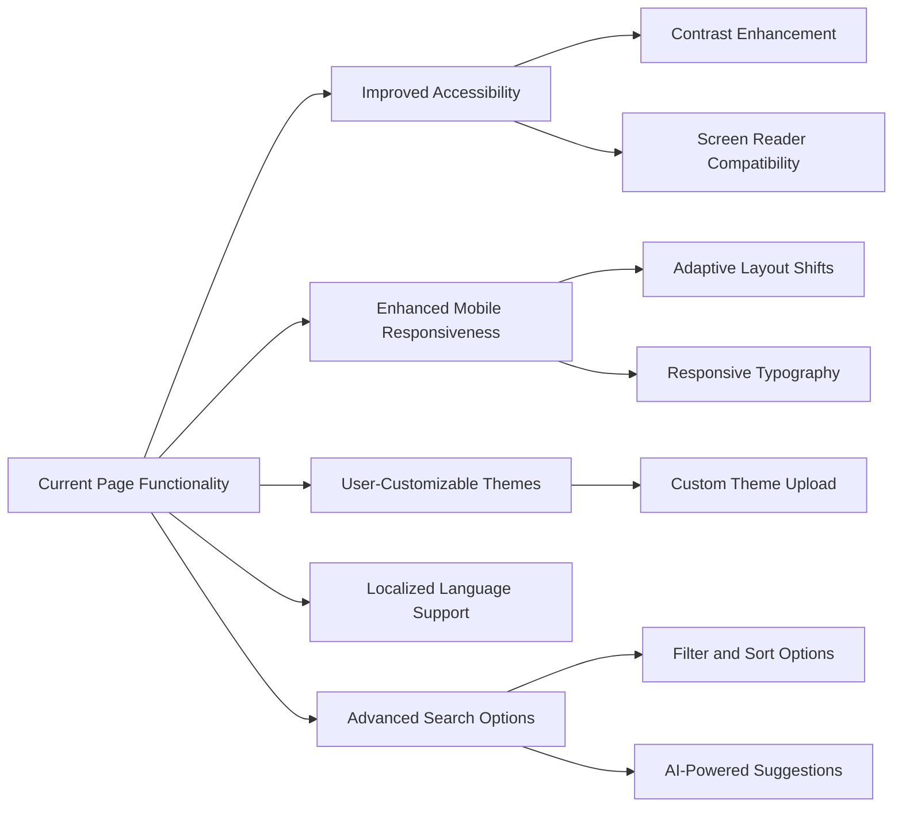

# Orange Cloud Search

**Orange Cloud Search** is a web application providing a [Google Custom Search Engine experience](https://programmablesearchengine.google.com/about/) with a Matrix-style aesthetic. It's designed to show autocomplete search suggestions with enhanced visual effects for an engaging user experience.

This project is part of an ecosystem integrating AI agents into various tools on web app and mobile app. This project is an web app interface that allow you to connect ans customize Google Programmable Search engine in the backend. 
This project will integrate with Vertex AI Search https://cloud.google.com/enterprise-search for better search capability soon.

This project will link to an iOS client app at this link. Follow that iOS client app version if you are interesting to integrate Google Progtammable Search API and AI agents with iOS mobile app.


## Features

- Matrix-style dynamic background animation
- Google Custom Search Engine integration
- Custom styling for better text contrast in search suggestions

## Installation

1. **Clone the repository:**

   ```bash
   git clone https://github.com/your-username/orange-cloud-search.git
   cd orange-cloud-search
   ```

2. **Open the `index.html` file:**

   You can open the `index.html` file directly in your favorite web browser to view the application locally.

## Deployment

Deploy the app via [GitHub Pages](https://pages.github.com/):

1. Push the code to a GitHub repository.
2. Go to the repository settings on GitHub.
3. Navigate to the "Pages" section.
4. Select the branch to deploy and save.

Your site will be live at `https://your-username.github.io/orange-cloud-search`.

## Contributing

Contributions are welcome! Please feel free to submit a pull request or open an issue.

## Roadmap

Here’s what we’re potentially working on next:



## License

This project is licensed under the [MIT License](LICENSE), which allows you to use, modify, and distribute the software as long as you provide proper credit to the original authors.

### Software License

This software is licensed under the [MIT License](LICENSE). You may use, copy, modify, merge, publish, distribute, and sublicense it, provided that you include the original license in all copies or substantial portions of the software.

### Documentation License

The documentation and other creative materials for this project are licensed under the [Creative Commons Attribution 4.0 International License](LICENSE-docs). You are free to share, adapt, and use the documentation, as long as you give appropriate credit to the original authors.

## Contact

[conglejobs@gmail.com](mailto:conglejobs@gmail.com)
